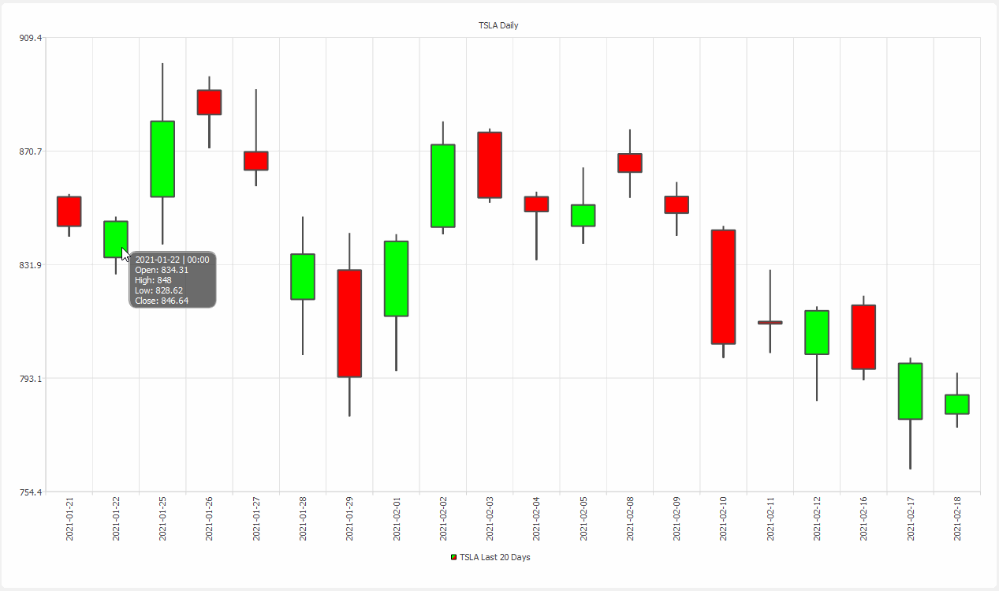

# QCandlestickChartView

A custom Qt5 widget written with C++ for displaying historical stock data in a candlestick format. This widget is designed to work in tandem with my [avapi](https://github.com/DavidM-Fox/avapi) library.

# Prerequisites
This widget requires my [avapi](https://github.com/DavidM-Fox/avapi) library to function along with its prerequisites as well.

# Example Usage
## Display daily stock data for a symbol of interest
The following shows the ```mainwindow.h``` of a simple Qt5 project with a ```QCandlestickChartView``` object set to be the central widget of the application. A demo gif is shown as well.

```C++

#include "../inc/mainwindow.h"
#include "../inc/QCandlestickChart.h"
#include "../inc/mainwindow_ui.h"

// MainWindow Constructor
MainWindow::MainWindow(QWidget *parent)
    : QMainWindow(parent), ui(new Ui::MainWindow)
{
    // Import ui from QT Designer
    ui->setupUi(this);

    // Get a daily time series for TSLA from the last 20 days
    avapi::Quote quote("TSLA", avapi::readFirstLineFromFile("../../api.key"));
    avapi::time_series series = quote.getTimeSeries(avapi::DAILY, 20);

    // Creating the chart view
    QCandlestickChartView *chart_view = new QCandlestickChartView();
    chart_view->setChartTitle(QString::fromStdString("TSLA"));

    // Add the avapi::time_series and set defaults
    chart_view->addAvapiSeries(series, QString::fromStdString("Last 20 Days"),
                               avapi::DAILY);
    chart_view->setViewDefaults();
    chart_view->setChartDefaults();
    this->setCentralWidget(chart_view);
}

// MainWindow Deconstructor
MainWindow::~MainWindow() { delete ui; }

```

